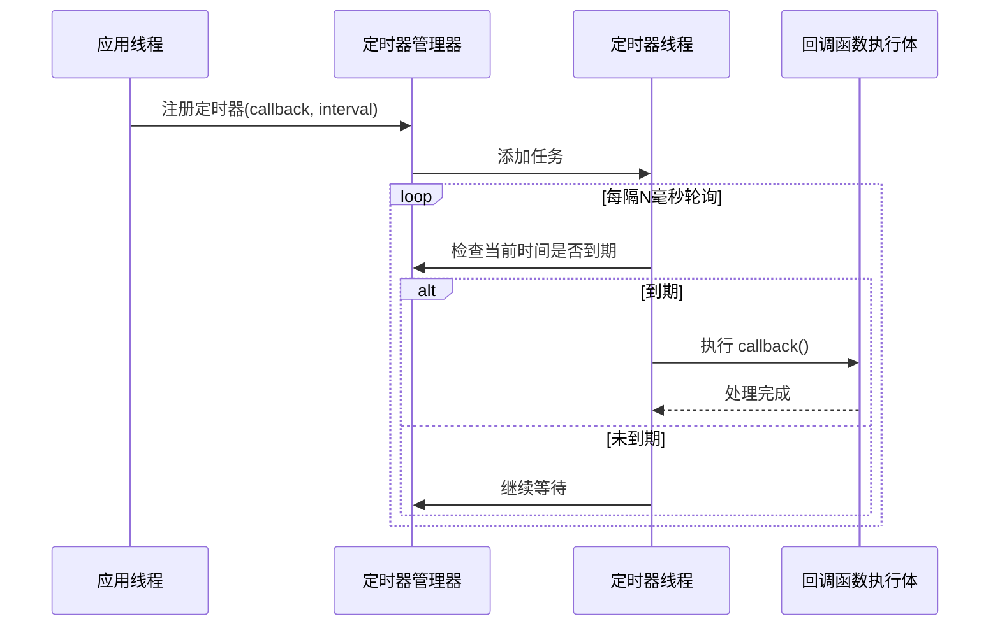
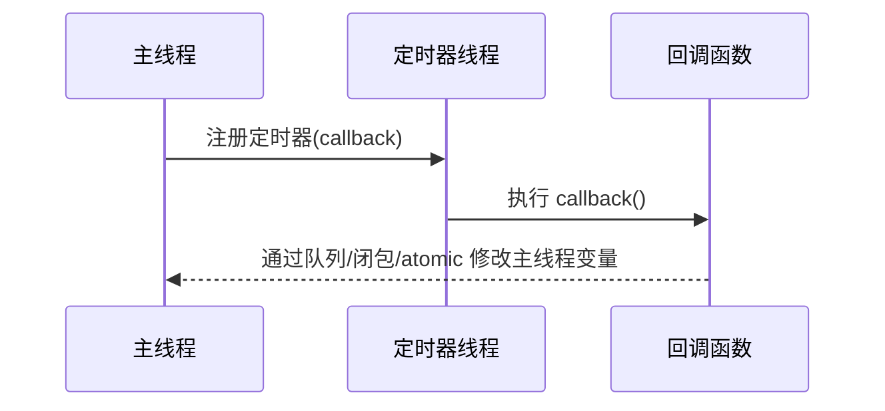

当一个**定时器到期时**，它的回调函数是如何被执行的？这个过程涉及多个系统/线程机制。下面我将用**详细流程图**与**时序图**来说明定时器的生命周期，从注册到触发回调的完整过程。

---

## 🧭 一、定时器回调执行的总体流程图

### ✅ 流程示意图（以用户空间定时器为例，例如基于 `std::thread` 或事件驱动库）

```mermaid
flowchart TD
    A[应用线程注册定时器<br>SetTimer(callback, interval)] --> B[定时器管理器记录任务]
    B --> C[后台定时器线程/事件循环]
    C --> D{当前时间 >= 到期时间?}
    D -- 否 --> C
    D -- 是 --> E[触发回调 callback()]
    E --> F[执行业务逻辑 / 通知原线程（可选）]
```

---

## 🕰️ 二、时序图（基于多线程模型）

假设应用线程注册定时器，定时器线程周期性检查是否超时。



---

## 🧩 三、详细流程分解

| 步骤            | 内容                                                                               |
| ------------- | -------------------------------------------------------------------------------- |
| **1. 注册定时器**  | 应用调用注册接口（如 `add_timer(callback, interval)`）                                      |
| **2. 存入任务队列** | 定时器管理器保存 callback 和下一次触发时间                                                       |
| **3. 后台线程轮询** | 定时器线程使用 `sleep_until()`、`select()`、`epoll_wait()` 或 `condvar.wait_until()` 等机制等待 |
| **4. 检查时间**   | 一旦当前时间 >= 到期时间，就调用回调函数                                                           |
| **5. 回调执行**   | 通常在后台线程直接执行回调；也可使用消息队列通知主线程                                                      |
| **6. 重复任务**   | 如果是周期性定时器，会重设 next\_run 时间重新加入轮询                                                 |

---

## 🧵 四、线程间变量影响示意（如回调要修改主线程数据）



* ✅ 如果**回调函数直接修改主线程变量**，需要：

  * 使用 `std::atomic`
  * 使用线程安全队列（例如 `std::queue` + mutex）
  * 使用 `post()`、`dispatch()` 等任务分发机制（如 Boost.Asio）

---

## 🧪 示例：队列通信方式（主线程变量由回调间接修改）

```cpp
std::queue<std::string> messageQueue;
std::mutex queueMutex;

void timerCallback() {
    std::lock_guard<std::mutex> lock(queueMutex);
    messageQueue.push("定时任务触发");
}

// 主线程循环处理消息
void processMessages() {
    while (true) {
        std::unique_lock<std::mutex> lock(queueMutex);
        while (!messageQueue.empty()) {
            std::cout << "主线程收到：" << messageQueue.front() << "\n";
            messageQueue.pop();
        }
        lock.unlock();
        std::this_thread::sleep_for(std::chrono::milliseconds(100));
    }
}
```

---

## 📌 总结

| 类别      | 描述                            |
| ------- | ----------------------------- |
| ✅ 注册    | 应用线程设置任务（callback + interval） |
| 🔄 调度   | 定时器线程或事件循环轮询到期任务              |
| ⏱️ 触发   | 到期则执行 callback，或通知主线程         |
| 🔧 共享数据 | 若回调访问原线程数据，需通信机制保障安全          |

---

如果你有特定平台（如 Linux `timerfd`、`asio`、`libevent`）或特定风格（如 C 实现、单线程模型）需要进一步演示，也可以告诉我，我可以补充那部分内容。
